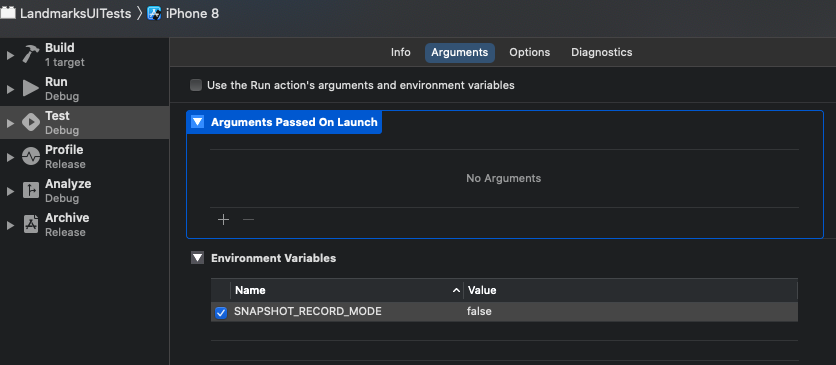

# swift ui snapshot application

## Description

A Swift Application that uses SwiftUI and uses the library `swift snapshot testing` to take snapshots

## Contents

- [Setup Steps](#setup-steps)
- [How to run the project locally](#how-to-run-the-project-locally)
- [Tools](#tools)
- [Update Dependencies](#update-dependencies)
- [Releases](#releases)
- [Helpful resources](#helpful-resources)

## Setup Steps

To use the test tool `Swift-snapshot-tesing`, we first need to import the test dependency, the easiest way by using Swift Package Manager.

Go to File then Swift Packages, then select Add Package Dependencies then add the Github url https://github.com/pointfreeco/swift-snapshot-testing to the `LandMarksUITests`.

To add an environment variable to the scheme `LandMarksUITests`. See the following image

<p></p>

Then you want to go to `LandMarksUITests.swift` and add the following to the `setUp`, this will make it easy to determine when we want and don't want to record snapshot.

```swift
override func setUp(){
    if ProcessInfo.processInfo.environment["SNAPSHOT_RECORD_MODE"] == "true" {
    SnapshotTesting.isRecording = true
    }
}
```

An example of a snapshot test that uses `Swift-snapshot-testing` is the one below, we define what device we want and what the end name of the image should be, so the image will be called `testTableViewController.iphone-8.png` when we record it.

```swift
func testTableViewController() {
    class TableViewController: UITableViewController {
    override func viewDidLoad() {
        super.viewDidLoad()
        self.tableView.register(UITableViewCell.self, forCellReuseIdentifier: "Cell")
    }
    override func tableView(_ tableView: UITableView, numberOfRowsInSection section: Int) -> Int {
        return 10
    }
    override func tableView(_ tableView: UITableView, cellForRowAt indexPath: IndexPath) -> UITableViewCell {
        let cell = tableView.dequeueReusableCell(withIdentifier: "Cell", for: indexPath)
        cell.textLabel?.text = "\(indexPath.row)"
        return cell
    }
    }
    let tableViewController = TableViewController()
    assertSnapshot(matching: tableViewController, as: .image(on: .iPhone8), named: "iphone-8")
}
```

An example of a snapshot test assert than you can use to test different font sizes

```swift
assertSnapshot(matching: tableViewController, as: .image(on: .iPhone8, traits: .init(preferredContentSizeCategory: .extraLarge)), named: "iphone-8")
```

## How to run the project locally

To run the snapshot tests locally, run the following.

```
bundle exec fastlane run_snapshots
```

To record new snapshots locally, run the following.

```
bundle exec fastlane record_snapshots
```

## Tools

**Linter:** we use the following linter [link](https://github.com/github/super-linter).

**Uploading Artifacts:**  we use the following way to upload Artifacts, they allow you to persist data like test results after a job has completed, see the following documentation [link](https://docs.github.com/en/actions/configuring-and-managing-workflows/persisting-workflow-data-using-artifacts).

**Creating images/icons:** we use Figma to create images and icon. Figma makes it very easy to create designs in many different formats.

**Creating a Mock Server:** we use a mock server with Postman to quickly test apis, to see how to create a mock server, see the following video [link](https://www.youtube.com/watch?v=rJY8uUH2TIk). 

### Mobile Specific Tools:
 
**Fastlane:** Fastlane allows us to automate our development and release process [link](https://docs.fastlane.tools/).

**App Center:** App Center is used to distribute an app, making it very easy to test on a physical device by using a fastlane plugin [link](https://github.com/microsoft/fastlane-plugin-appcenter).

**Proxyman:** we use Proxyman to view HTTP/HTTPS requests as they happen, it is easier to debug network connections on mobile on Proxyman where we can test and mock specific network responses, see the following documentation [link](https://docs.proxyman.io/debug-devices/ios-simulator). 

## Update Dependencies

**Npm:** How to update a npm package.
- [link](https://docs.npmjs.com/cli/update).

**Gemfile:** How to update a Gemfile package.
- [link](https://bundler.io/man/bundle-update.1.html#UPDATING-A-LIST-OF-GEMS).

## Releases

How to manage releases in a repository [link](https://help.github.com/en/github/administering-a-repository/managing-releases-in-a-repository). 

## Helpful resources

The following links to a Swift snapshot library called `swift snapshot testing` that you can use to take snapshots.
- [link](https://github.com/pointfreeco/swift-snapshot-testing).

The following links to a guide on how you can take snapshots of SwiftUI views.
- [link](https://www.vadimbulavin.com/snapshot-testing-swiftui-views/).

The following links to a guide by Apple on how to create views in SwiftUI, it's a very handy guide.
- [link](https://developer.apple.com/tutorials/swiftui/creating-and-combining-views).

The following links to a video tutorial for `SwiftUI Basics for Beginners`.
- [link](https://www.youtube.com/watch?v=IIDiqgdn2yo).

The following links to a guide on how to add a bar button to a navigation bar.
- [link](https://www.hackingwithswift.com/example-code/uikit/how-to-add-a-bar-button-to-a-navigation-bar).

`N.B.` The following links to a guide on how view controllers works including how to update a view and adding a child view to a view controller.
- [link](https://cocoacasts.com/managing-view-controllers-with-container-view-controllers/).

The following links to a test from `swift snapshot testing` called `testTableViewController`.
- [link](https://github.com/pointfreeco/swift-snapshot-testing/blob/main/Tests/SnapshotTestingTests/SnapshotTestingTests.swift#L337
).

The following links to a test from `swift snapshot testing` called `testTraitsEmbeddedInTabNavigation`.
- [link](https://github.com/pointfreeco/swift-snapshot-testing/blob/main/Tests/SnapshotTestingTests/SnapshotTestingTests.swift#L535
).

The following links to a test from `swift snapshot testing` that updates the size of the text, good for tests that test different font sizes.
- [link](https://github.com/pointfreeco/swift-snapshot-testing/blob/7b8e0b26dfc0730869fa62ac954e9547bfd47dc5/Tests/SnapshotTestingTests/SnapshotTestingTests.swift#L521
).

The following links to how you set up `environment variable` in iOS, this setup is very helpful for testing.
- [link](https://medium.com/@derrickho_28266/xcode-custom-environment-variables-681b5b8674ec
).

The following links to a fix to the following error `The scheme 'LandmarksUITests' has nothing configured to build for Running and has no executable specified to Run. Edit the scheme to configure the Run action.`
- [link](https://stackoverflow.com/a/41953023
).